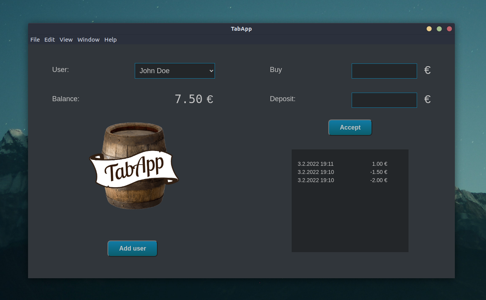

# tabAppElectron
A simple bar tab desktop app, written in node.js, using [electron.js](https://www.electronjs.org/) for windowing and [SQLite](https://www.sqlite.org/) for storage



## Installation
### Linux
#### AppImage
Download the latest AppImage from releases and save it in some convenient location. Installation completed!

#### Snap
Download the latest snap file from releases and install it using
```
snap install ~/Downloads/tabapp_1.0.0_amd64.snap --dangerous
```

## Development

### Prerequisites

- [node](https://nodejs.org)

### Run in dev mode

1. Install packages using `npm i`
1. Launch app using `npm start` 

### Distribution

1. Install packages using `npm i`
1. Run `npm run dist` to package app in distributable format
1. Navigate to the `dist` folder and find the suitable executable for your OS